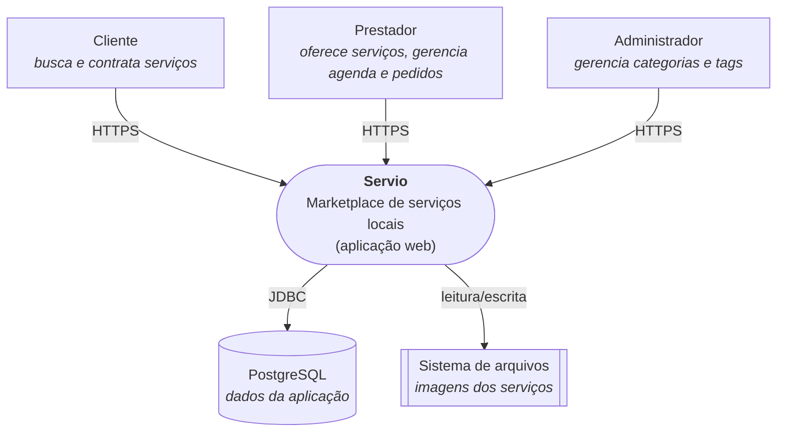
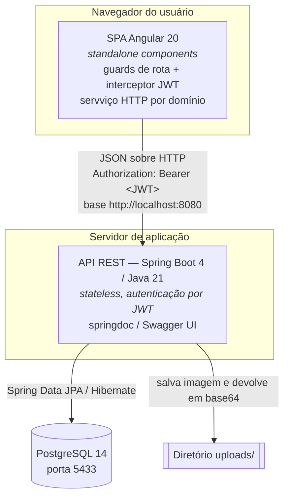
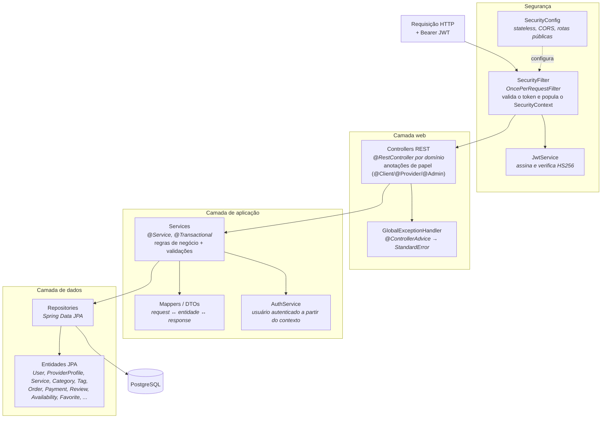
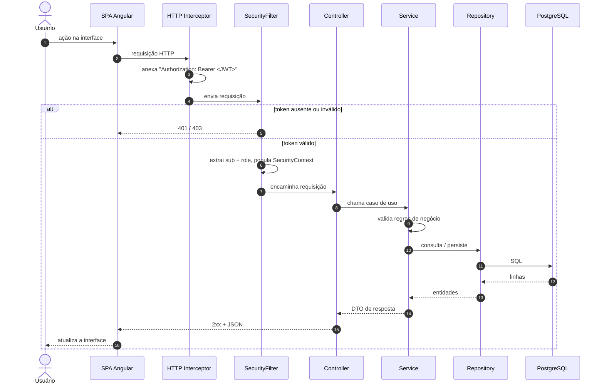

# Diagramas de Arquitetura Geral — Servio

Visão arquitetural do sistema **Servio**, no estilo **C4** (Contexto → Contêineres
→ Componentes), com um diagrama de sequência do fluxo de requisição autenticada.
Diagramas produzidos em Mermaid com apoio de IA (Claude) e revisados pela dupla.

* **Autoras**: Bianca Antonelly, Maria Clara Fernandes
* **Data**: 2026-09-09
* **Relacionados**: [ADR-001](../adr/ADR-001-adocao-sdd-e-harness-de-ia.md) · [diagrama de favoritos](diagrama-favoritos.md)

---

## 1. Nível 1 — Contexto

---

## 2. Nível 2 — Contêineres

**Contrato entre contêineres:** API REST com recursos por domínio
(`/auth`, `/users`, `/services`, `/orders`, `/reviews`, `/favorites`,
`/category`, `/tags`, `/api/calendar`, `/financial-dashboard`). O front-end
depende apenas desse contrato HTTP; não há acoplamento de código entre SPA e API.

---

## 3. Nível 3 — Componentes da API (backend)

**Princípios aplicados (ADR-001):**
- Camadas com responsabilidade única e dependências em uma só direção
  (web → aplicação → dados).
- Baixo acoplamento: controllers não acessam repositórios; regras ficam nos
  services.
- Contrato explícito de erro (`GlobalExceptionHandler` → `StandardError`).

---

## 4. Fluxo de uma requisição autenticada

---

## 5. Observações de arquitetura

- **Autenticação** por JWT HS256 (claims `sub`, `role`, `name`, expiração 24h);
  API sem sessão (`SessionCreationPolicy.STATELESS`).
- **Autorização de papel**: as anotações `@Client` / `@Provider` / `@Admin`
  expressam a intenção de acesso por endpoint. Hoje a verificação por método
  (`@PreAuthorize`) não está ativa (falta `@EnableMethodSecurity`); regras
  sensíveis por papel são reforçadas na camada de serviço (ex.: favoritos
  restrito a `CLIENT`). Ponto registrado para correção.
- **Imagens** dos serviços são gravadas em disco (`uploads/`) e trafegam para o
  front-end como base64 dentro do DTO.
- **Documentação viva da API** via springdoc em `/swagger-ui.html`.
- **Esquema do banco** gerado pelo Hibernate (`ddl-auto=update`) a partir das
  entidades JPA.
