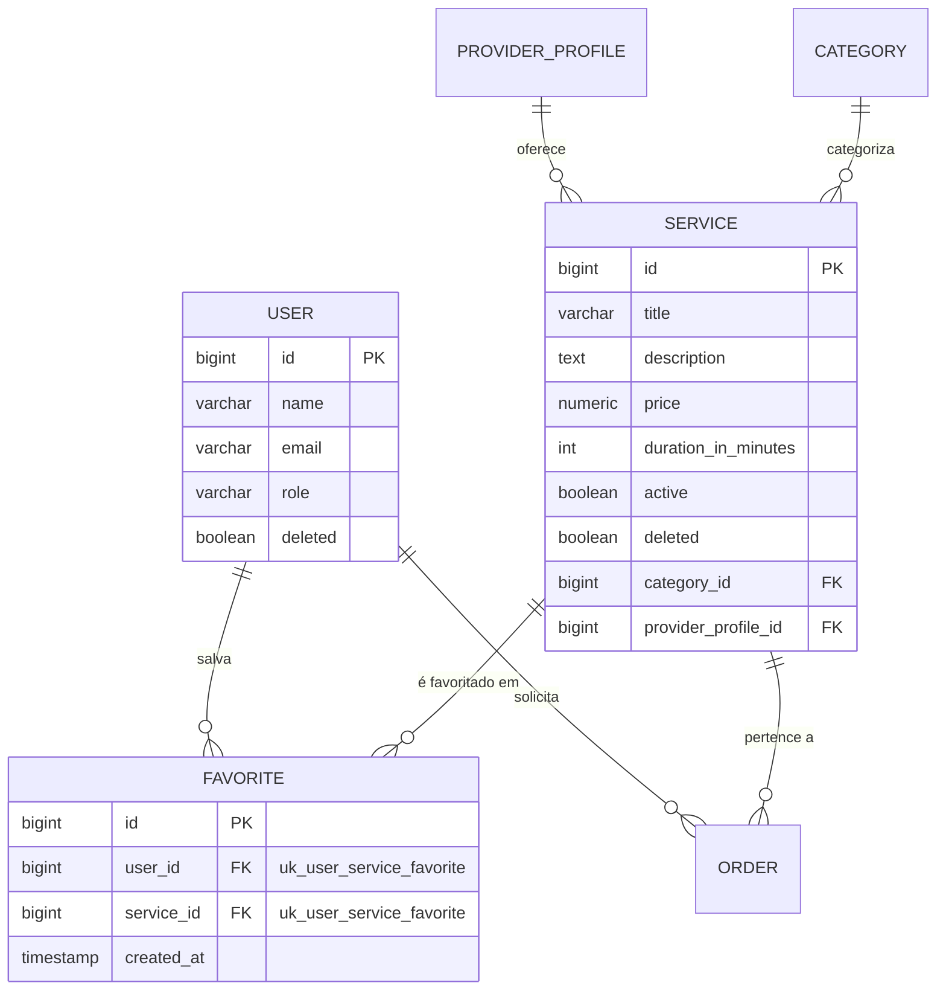
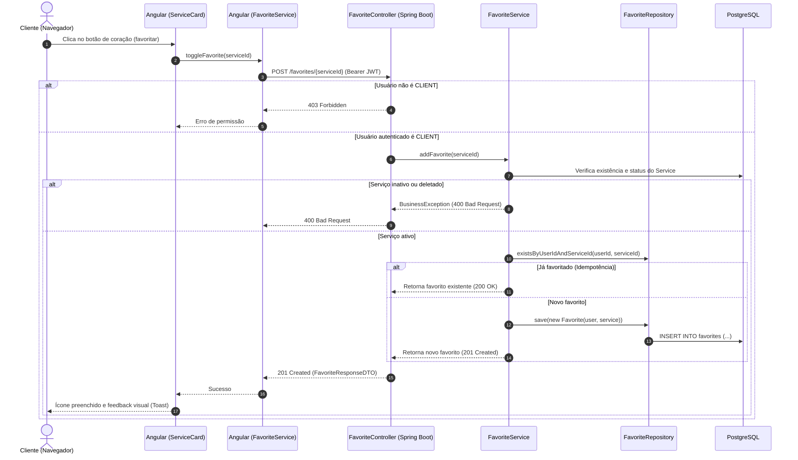
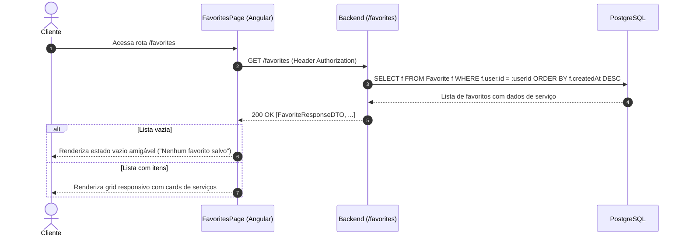

# Diagramas de Arquitetura e Modelo - Sistema de Favoritos

Este documento apresenta os diagramas visuais gerados com apoio de Inteligência Artificial para representar o modelo de dados e o fluxo de interação do **Sistema de Favoritos** (Requisito 1).

---

## 1. Diagrama de Entidade-Relacionamento (ERD)

---

## 2. Diagrama de Sequência (Fluxo de Favoritar Serviço)

---

## 3. Diagrama de Sequência (Listagem "Meus Favoritos")

