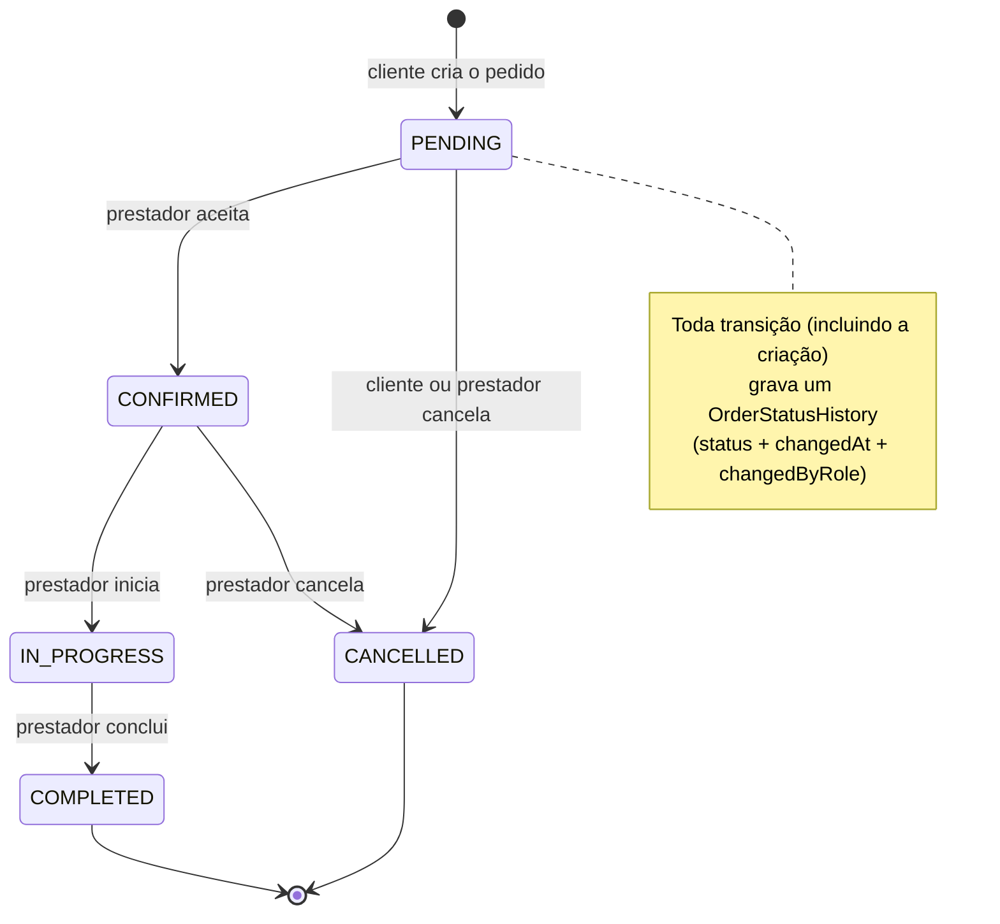
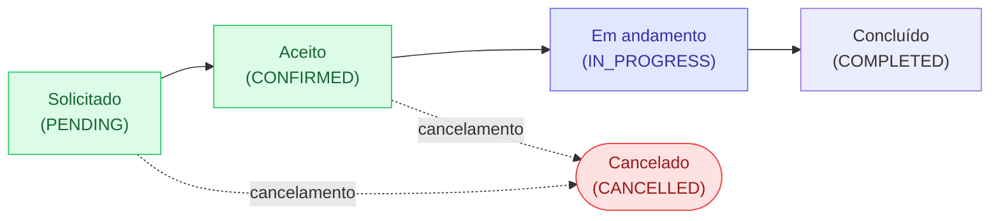
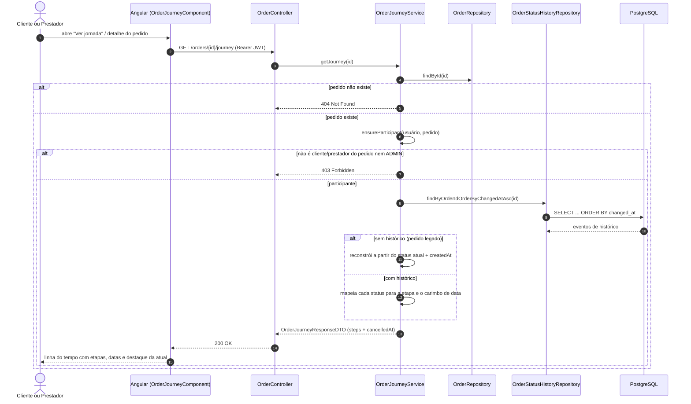

# Diagramas — Jornada do Pedido (RF-13)

Diagramas do requisito **RF-13**, produzidos em Mermaid com apoio de IA e
revisados pela dupla. Referências: [SPEC-002](../specs/SPEC-002-jornada-do-pedido.md) ·
[ADR-003](../adr/ADR-003-historico-de-status-e-jornada-do-pedido.md).

* **Autoras**: Bianca Antonelly, Maria Clara Fernandes
* **Data**: 2026-09-09

---

## 1. Máquina de estados do pedido (após a SPEC-002)

---

## 2. Etapas canônicas da jornada

> Estados por etapa retornados pela API: `DONE` (concluída), `CURRENT` (etapa
> atual), `PENDING` (futura), `SKIPPED` (pulada por cancelamento).

---

## 3. Consulta da jornada — `GET /orders/{id}/journey`

