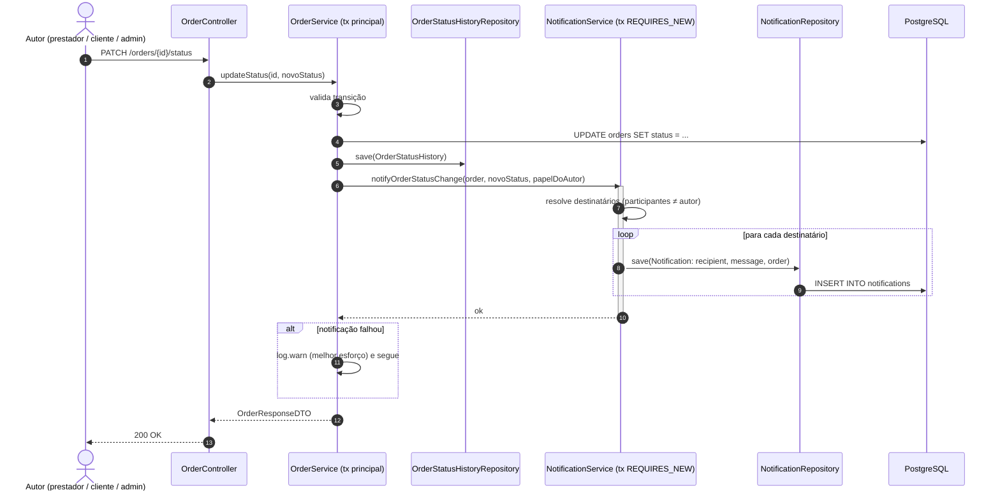
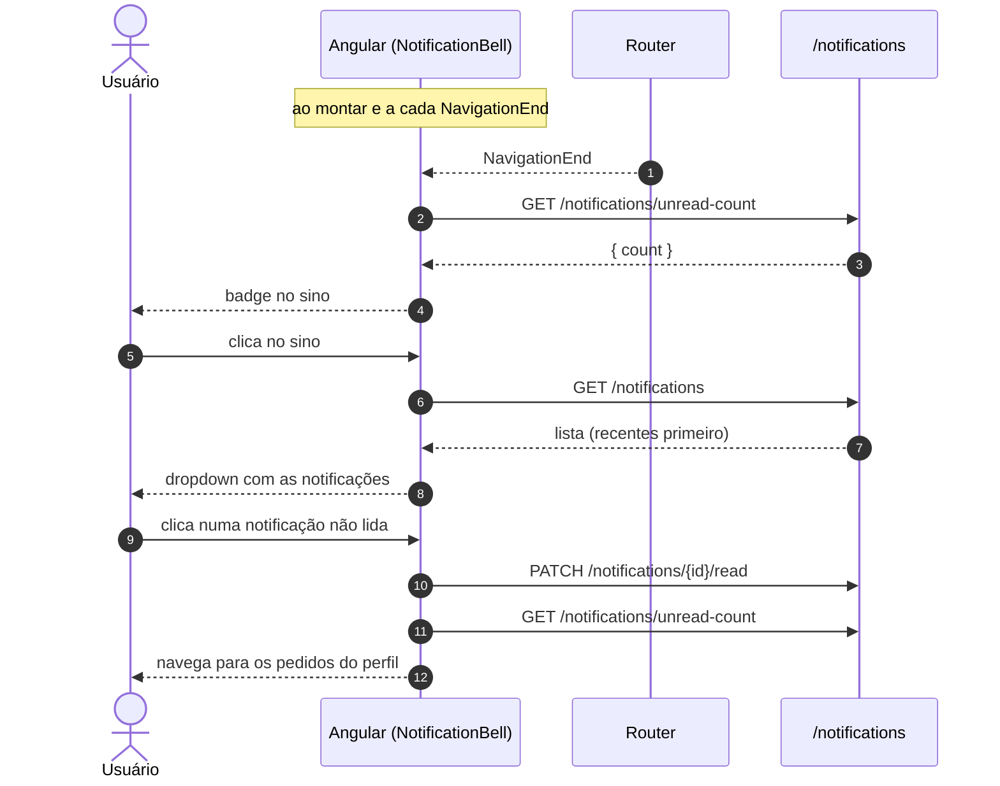

# Diagramas — Notificações de Mudança de Status (RF-14)

Diagramas do requisito **RF-14**, produzidos em Mermaid com apoio de IA e
revisados pela dupla. Referências: [SPEC-003](../specs/SPEC-003-notificacoes-de-status.md) ·
[ADR-004](../adr/ADR-004-notificacoes-in-app-melhor-esforco.md).

* **Autoras**: Bianca Antonelly, Maria Clara Fernandes
* **Data**: 2026-09-09

---

## 1. Geração da notificação na mudança de status



---

## 2. Regra de destinatário

```mermaid
flowchart TD
    C{Quem mudou<br/>o status?}
    C -->|PROVIDER| N1[Notifica o cliente]
    C -->|CLIENT| N2[Notifica o prestador]
    C -->|ADMIN| N3[Notifica cliente e prestador]

    N1 --> M["message = 'Seu pedido \"&lt;serviço&gt;\" mudou para: &lt;status&gt;'"]
    N2 --> M
    N3 --> M
```

> O autor da mudança **nunca** recebe notificação da própria ação.

---

## 3. Exibição no cliente (sino da sidebar)


